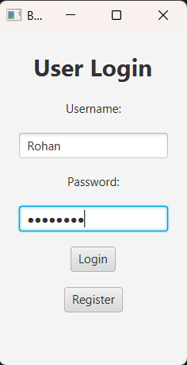
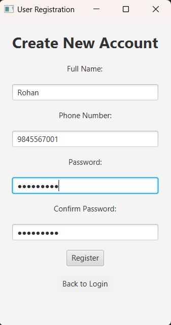
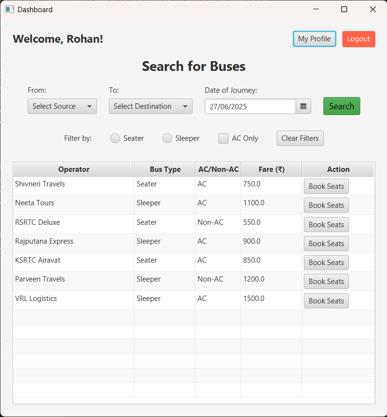
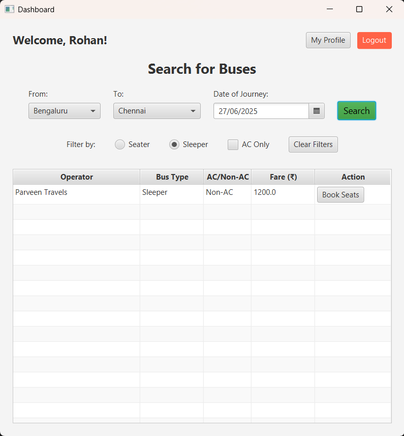
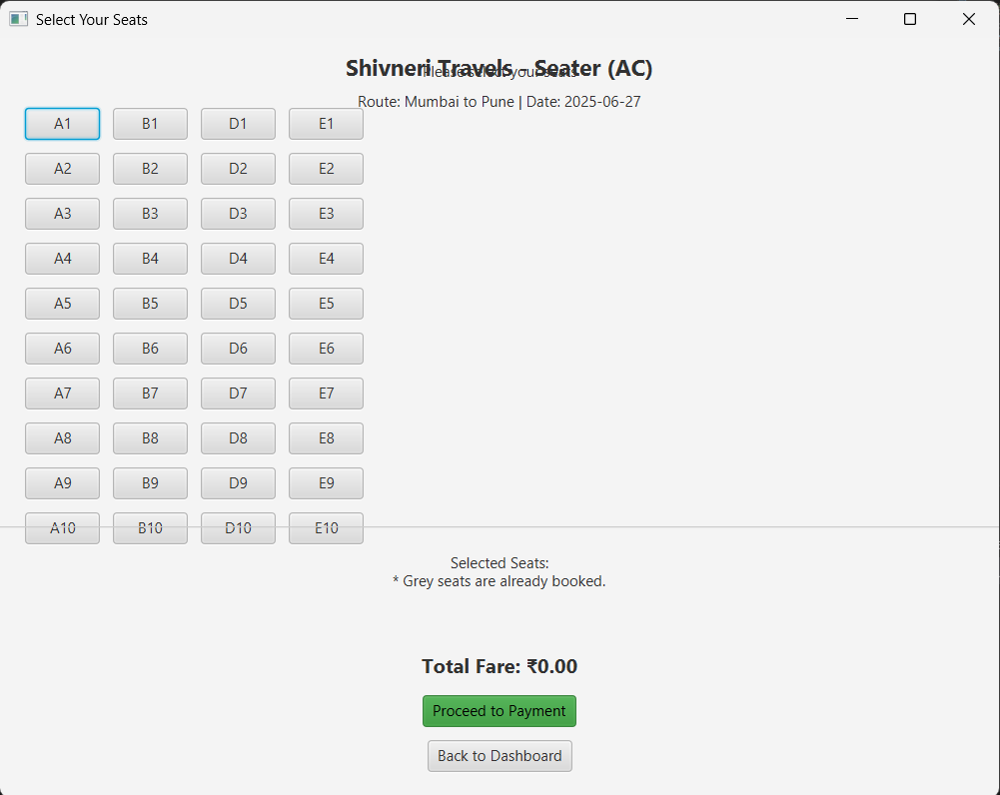
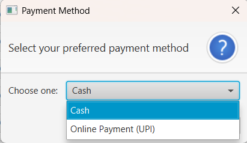
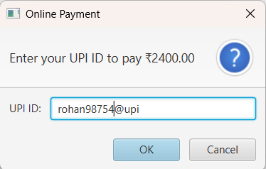
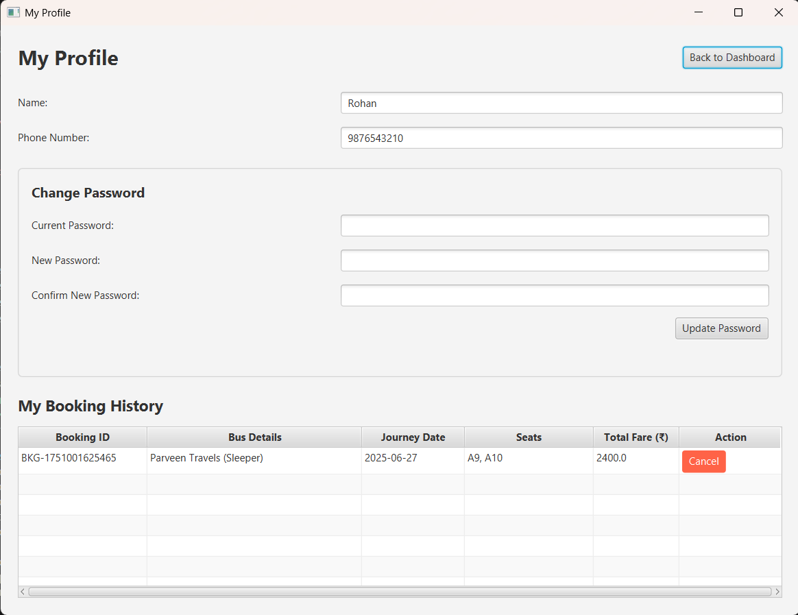

# Bus Reservation System

A comprehensive, desktop-based Bus Reservation System built with Java and JavaFX. This project is a practical implementation of Object-Oriented Programming (OOP) principles and various Java technologies.

## Overview

This application provides a user-friendly graphical interface for users to search for buses, book seats, manage their profiles, and view their booking history. It is designed as a standalone desktop application, simulating a real-world ticket booking platform.

## Features

- **User Authentication:**
  - Secure user registration with a name, phone number, and password.
  - User login with credentials.
- **Bus Search and Filtering:**
  - Search for available buses by selecting a source, destination, and date.
  - Filter search results by bus type (Seater/Sleeper) and amenities (AC/Non-AC).
- **Interactive Seat Booking:**
  - Visual seat selection from a dynamic bus layout.
  - Ability to book one or multiple seats in a single transaction.
  - Simple payment simulation (Cash/Online).
- **Booking Management:**
  - Users can view all their past and upcoming bookings.
  - Functionality to cancel a booked ticket.
- **User Profile Management:**
  - View and update personal details (e.g., change password).

## Technologies and Concepts Covered

- **Core Java (Version 17):**
  - **OOP Principles:** Abstraction, Encapsulation, Inheritance, and Polymorphism.
  - **Data Structures:** `ArrayList` for managing collections of users, buses, and bookings. 2D arrays for seat layouts.
  - **Exception Handling:** Custom exceptions (`SeatUnavailableException`) and `try-catch` blocks for robust error management.
  - **Multithreading:** Basic use of `Task` for background operations (e.g., loading data).
  - **String Handling:** For data validation and manipulation.
  - **File I/O:** Using `ObjectOutputStream` and `ObjectInputStream` for data persistence (saving user and booking data to files).

- **JavaFX (GUI):**
  - FXML for declarative UI design, separating layout from logic.
  - Scene Builder for visually creating layouts.
  - MVC (Model-View-Controller) design pattern.
  - Controls: `Button`, `TextField`, `ComboBox`, `DatePicker`, `CheckBox`, `RadioButton`, `ListView`, `GridPane`, and `ToggleButton`.
  - Event Handling for user interactions.

- **Development Practices:**
  - Adherence to principles from the **CERT Java Coding Standard**.
  - Version control with **Git and GitHub**.

## Application Screenshots

